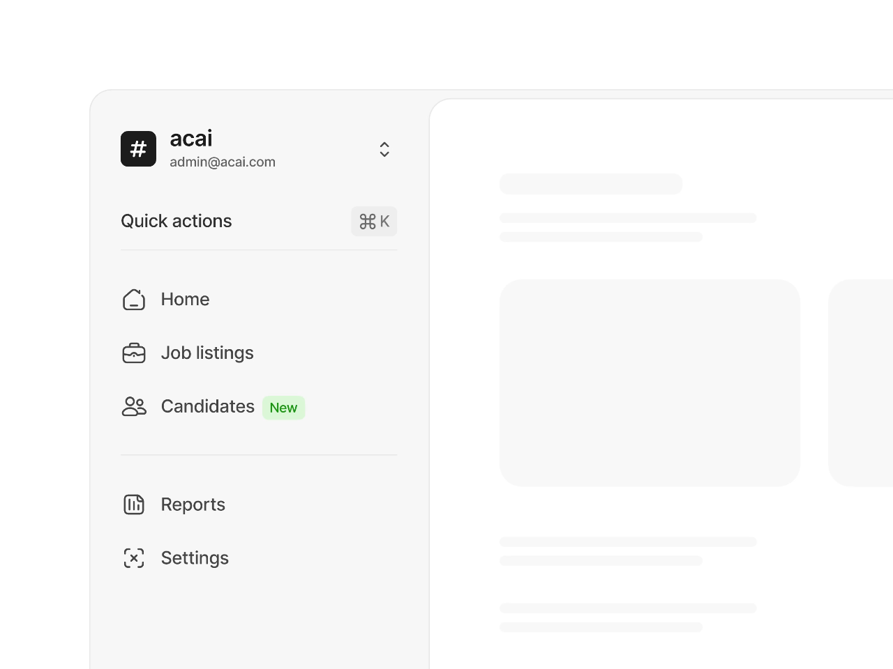

I am adding some figma links to make you understand how  i want the frontend to be . 
Use untitled Ui react component library for resuable components . 
and refer to the figma links and i recommended some changes for the website in UI.md file just make sure the changes are made but follow the design language 

link for untitiled ui : https://www.untitledui.com/react/components

figma links : 
https://www.figma.com/design/TOoCLj42WwH366qHGCXDjw/Notion-UI---Free-UI-Kit--Recreated---Community-?node-id=0-1&m=dev&t=uudzd9VXipk9l20G-1

https://www.figma.com/design/SKamVhmP8DV1loMxR8LllP/Notion-Icons---194-Free-Icons-for-Figma--Community-?node-id=14363-11&m=dev&t=SySuzfz9msAeqJqj-1

this is the most important 
use this colors for the website 
https://www.figma.com/design/r54XrbMJXca7erhJptBoLB/Notion-library--Community-?node-id=0-1&m=dev&t=bMqki2prPIVqkfxi-1

https://www.figma.com/design/l1JXomzCzmgaZKu6Nf31D9/Notion-Resources---3-154-Icons--Covers---Illustrations--Community-?node-id=2972-5&m=dev&t=RxruFV912b7owhtd-1

the sidebar should look something like this but follow the colors from the figma strictly for the sidebar 
 

