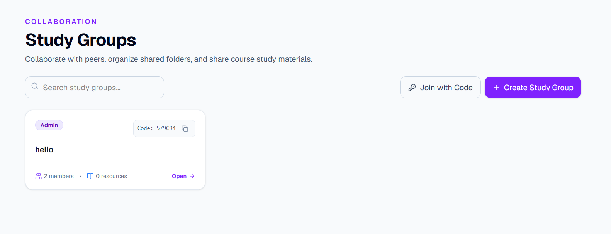
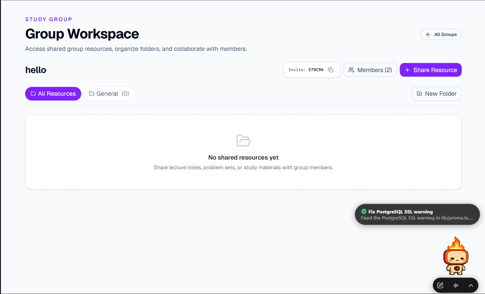
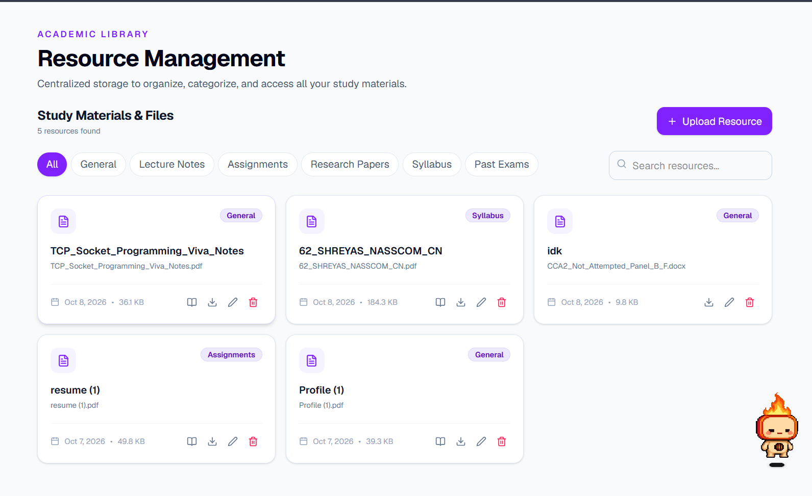
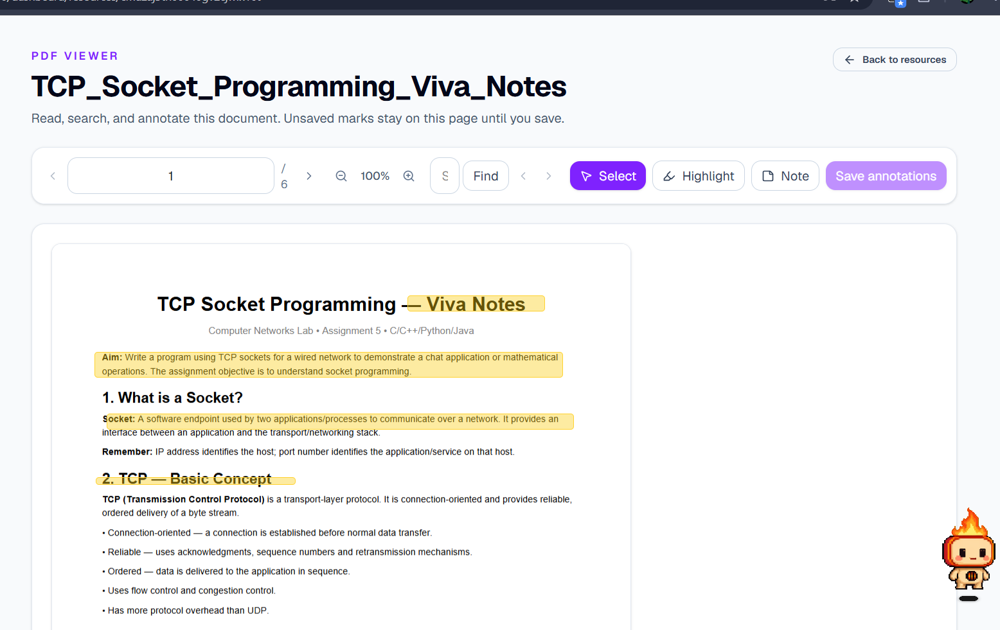
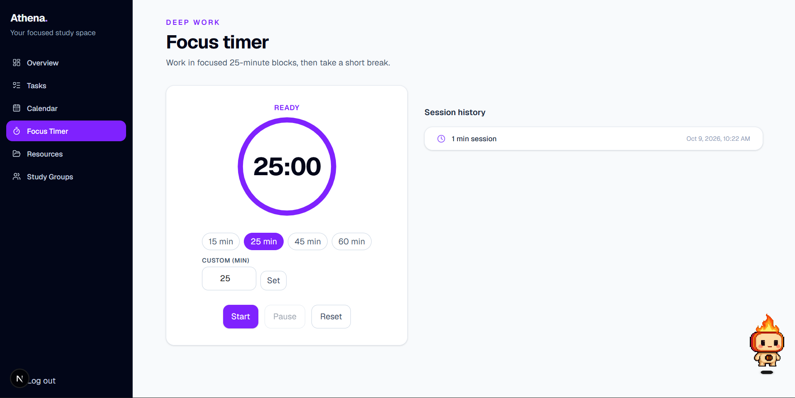
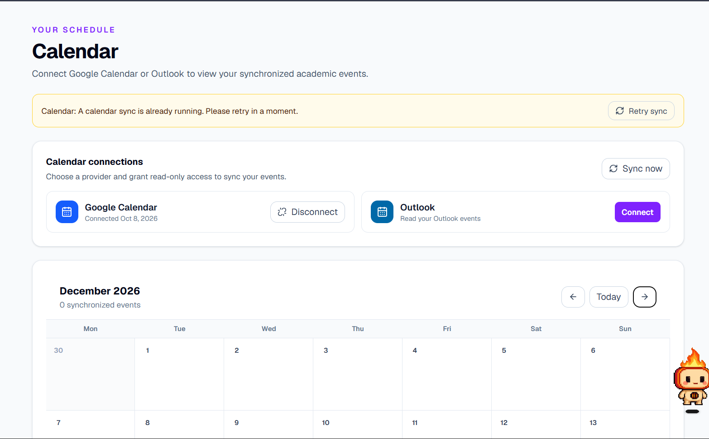
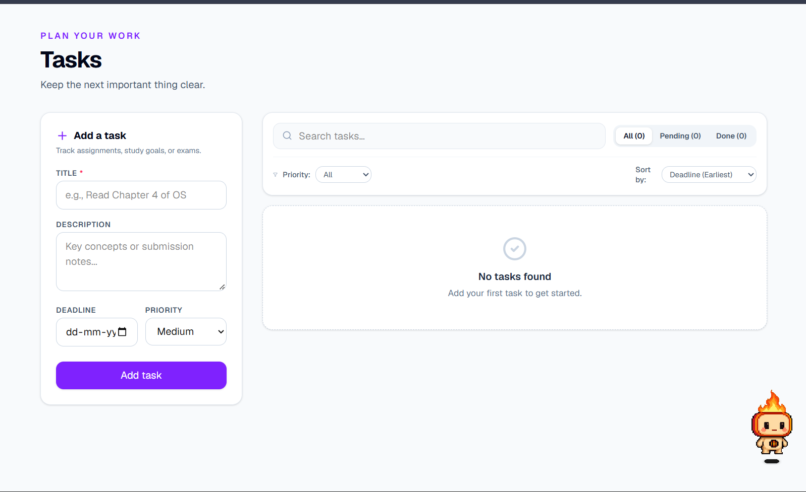

For the frontend overhaul i have added fighma links in DESIGN.md file in assets/ folder 
i want the frontend to look like notion and all the links are related tothe same . 
while making the below changes just refer the DESIGN.md file to keep the ui consistent throughout the website and use appropriate ui elements . 
DONT ADD ANY FILLER TEXT AND NO INDIGO BUTTONS THAT LOOK AI GENERATED . 

okay so i am creating this UI.md file to help understand the kind of UI or frontend i want  
the current ui sucks and needs a complete revamp 
i have stored some assets that you might need for using to update the frontend  
i will tell you the changes feature by feature :   

1. Study groups 
 
just keep the study groups text and remove all the other "filler text" like "collaboration" and the text below the "Study groups"  
swap the positions of the search bar and "join with code" and "create study group" button   
in the study group card dont keep an exclusive open button but rather , if you click on the card you will open the group   
keep group title at the top of the card , the code and title should be aligning with each other horizontally and the admin tag should be at the bottom of the card  

  
even here remove the "filler text" the title should be Study Group : "GROUP NAME" 
keep the "members" button besides the All resources Button and remove the new folder button for now and "share resource" should be aligned with "all resources" button but horizontally and should be kept at left  

2. Resource Managment 
 

- the usual remove the filler text : just keep the Resources text as title 
- remove Study Materials & Files text 
- remove the predefined categories and give user an option to add their own categories , in the same line as categories of the documents add a upload resource icon and search icon to search button , when click on search button it expands into a search bar 
- in the individual resource card dont add an exclusive open button , but rather when clicked on the card it opens the doc . 
- use different icons for pdf ,docx , and excel etc 
 
- remove the filler text . just keep the doc title 
- the back to resources button should be to the left of the screen 
- the current page number input is way too long make it shorter and format the page number component properly 
- the search bar is hidden , it should be visible 
- and align the pages in the pdf centrally 

3. Focus Timer 
 
- current ui looks decent , but add an end button if user wants to end the session abruptly and saved the time completed of the session till then 
- then ofc the classic remove the filler text and align the focus timer card and session history section properly.  

4. Calendar

- remove the calendar connections part and just keep to small button which displays google calendar and outlook is connected or not along with their original logos which i will provide in assets/ folder 
- and in the calendar section keep the next and previous button next to the month and not the "today" text and instead of "today" display today's date . 

5. Tasks

- remove the filler text ofc even in the "add a task" card and inside the deadline input the dd-mm-yyyy text is getting overlapped with the calendar icon , make it visible 
- in the search tasks section the "Sort by " text is should formatted correctly. 